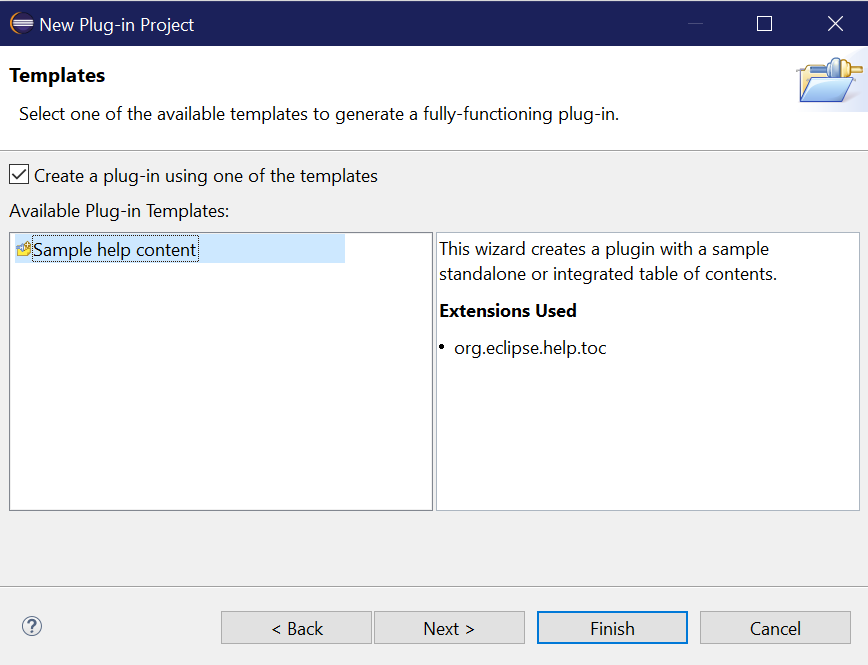
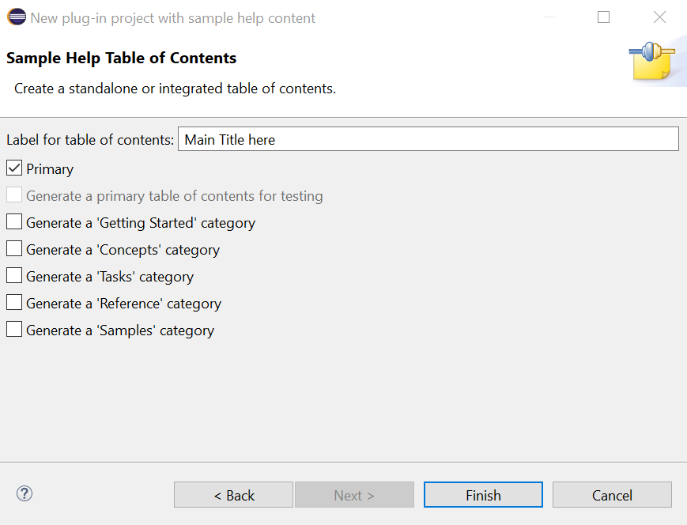

This plugin is the main entry point for HERMES documentations. It includes IML documentation and provides an anchor `extensions` for other plugins to contribute to this documentation and listed under the same book. 

## How to contribute to this documentation
1. Create an Eclipse plugin
2. Choose the `Sample help content` template:

 
3. Select the `Primary` option and choose a label for the documentation title:

4. Inside your main `toc.xml` file, link the your top `toc` element to this documentation by adding the following attribute to it:  `link_to="../com.utc.utrc.hermes.docs/toc.xml#extensions"`

## How to write Docs in Markdown (MD)
Since HTML is not the best way to write documentations, you can use markdown (MD)  (Check [here](https://www.markdownguide.org/basic-syntax/#links) for more details) 
to write your documents then use a tool to convert that `.md` file into `html`. One of the tools you can use is
 `GitHub Flavored Markdown Viewer plugin for Eclipse` (https://github.com/satyagraha/gfm_viewer). This tool needs internet access since it uses Github API to generate the HTML files. You can use the tool as following:
1. Install the plugin inside eclipse from the following repository URL: https://raw.githubusercontent.com/satyagraha/gfm_viewer/master/p2-composite/
2. Write your documentations inside `.md` files
3. Right click on the file/folder containing the `.md` files and choose `Generate Markdown Preview`. This will generate an HTML file for each markdown file selected. 
4. The generated file name will take the following format: `.original_name.md.html` giving the input file name was `original_name.md`.
