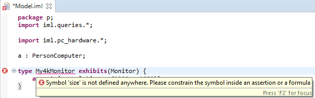

# Extending IML Validator

Providing custom library is a good way to support new domains by defining the basic elements of that domain. To have more control over how the user will use such library, the library developer will need to extend the validator and add validation rules over the library.

## Setting up IML Custom Validator
1. *Create new eclipse plugin project or use an existing one*: `File` > `New` > `Project` and select from `Plug-in Development` > `Plug-in Project`.
1. *Create validator class*: create normal Java or Xtend class that extends `com.utc.utrc.hermes.iml.validation.AbstractImlValidator`.
1. *Contribute to the extension point*: Go to the `META-INF` > `MANIFEST.MF` then select `Extensions` tab. Click `Add` and select `com.utc.utrc.hermes.iml.validators` extension point from the list. Under that extension point, right click and click `New` > `validator` then provide the fully qualified name for the validator class.
1. If you didn't find `com.utc.utrc.hermes.iml.validators` extension point in the list from previous step, you can directly add/modify `plugin.xml` by adding the following (change the class value to your validator class):
  ```xml
  <extension point="com.utc.utrc.hermes.iml.validators">
         <validator class="com.utc.utrc.hermes.iml.example.validator.ExampleValidator"> </validator>
   </extension>
  ```

## Writing custom validators
You can write your custom validations inside the validator class created in second step in the previous section. Inside this file you can write multiple validation methods. Each validation method should be annotated with `@Check` annotation and the signature should have only one parameter that extends `EObject`. You typically want to check first if the given element is the one you are interested in validating. For that you can use the service class defined in "Extending IML Libraries" section to check that. If you want to report any issues with the model, you can use the `error` method to do so. For more information, please check the custom validation section here: https://www.eclipse.org/Xtext/documentation/303_runtime_concepts.html#validation

For example, if you want to validate specific `NamedType` in you library, you can have the method as following:
```java
@Inject MyLibraryServices libServices
@Check
void checkMyType(NamedType element) {
    if (libServices.isMyType(element)) {
        // Write your custom validation here
        if (somethingIsWrong) {
            error("Custom error message" , ImlPackage::eINSTANCE.symbol_Name, UNIQUE_ID_FOR_THE_ERROR)
        }
    }
}
```

## Using the custom validator
After setting up and writing down your validators, there are two ways you can use that validator described below. In both cases, the user will need to add this validator project to the project dependencies in `META-INF` > `MANIFEST.MF` > `Dependencies` and add it under `Required Plug-ins`. 
### Programmatically for Validating IML file
User can validate IML parsed files to ensure there is no errors. The custom validators that contributes to `com.utc.utrc.hermes.iml.validators` will be automatically picked and run against the IML model.

This approach is typically used while writing test cases where the user can use `org.eclipse.xtext.testing.validation.ValidationTestHelper` methods like `assertNoErrors` or `assertError`. See `com.utc.utrc.hermes.iml.example.test` project for an example of this usage.

To validate IML models programmatically outside the test environment, user can use `com.utc.utrc.hermes.iml.ImlParseHelper.checkErrors()` method. 
### Runtime as part of Eclipse IDE
User can also use the custom validator inside an Eclipse IDE instance or part of Eclipse custom product by installing the plugin there. The custom validator will run on compatible types while editing an IML file and any error will be reported by Eclipse. Example for an error reported by the example custom validators inside `com.utc.utrc.hermes.iml.example.validator.ExampleValidator` is shown below:
